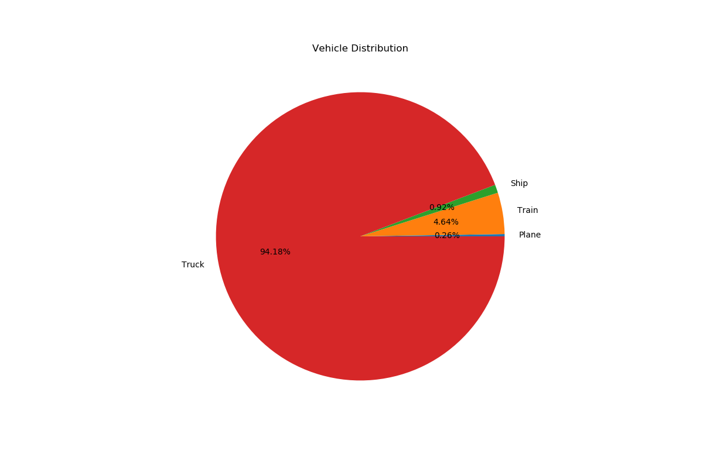
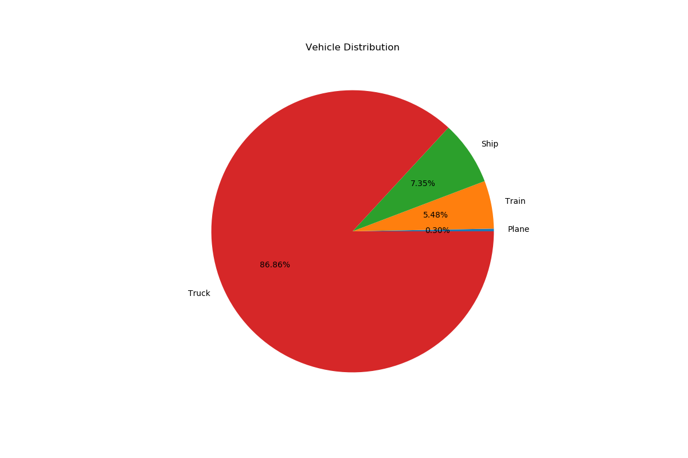
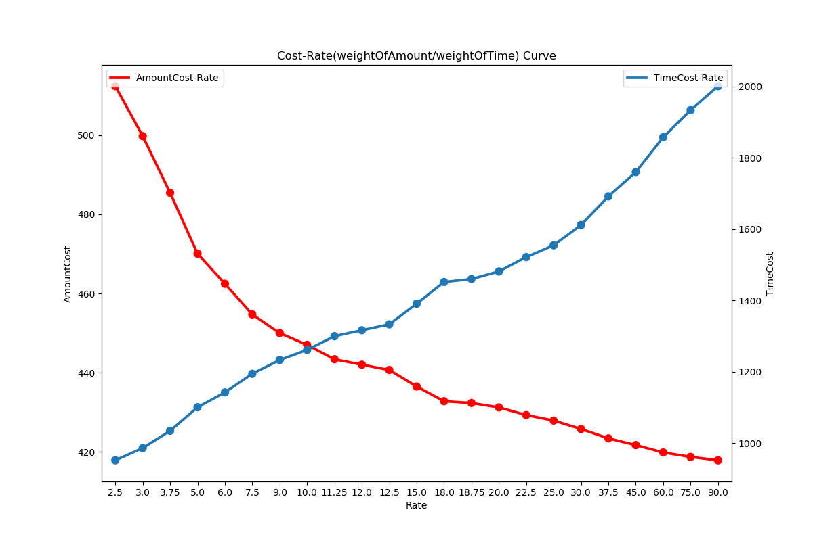
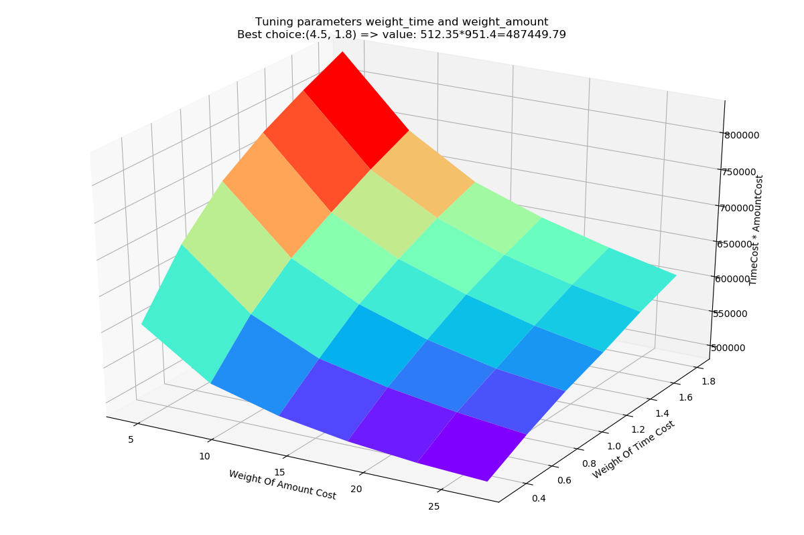
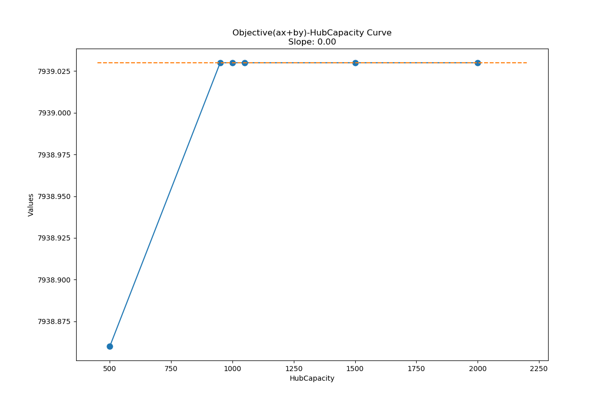
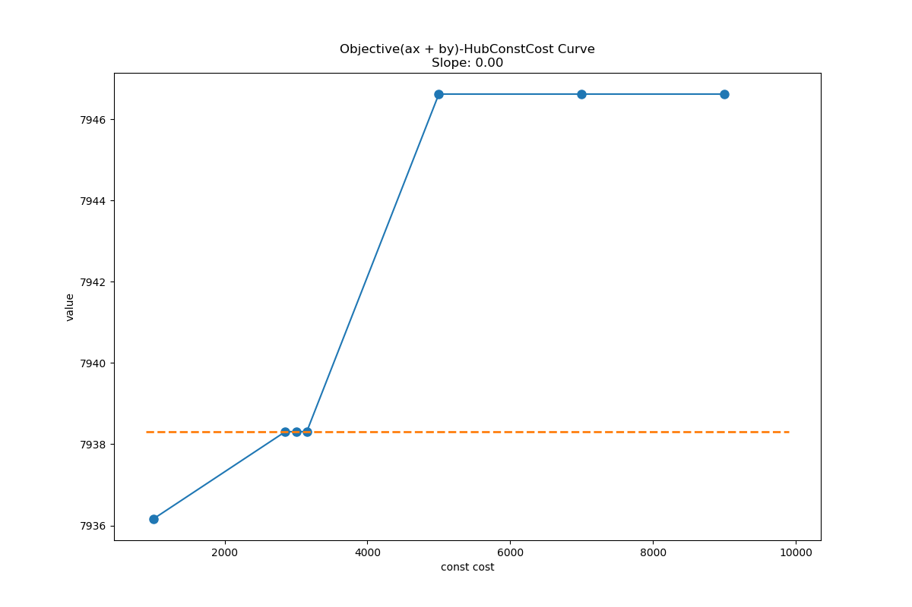
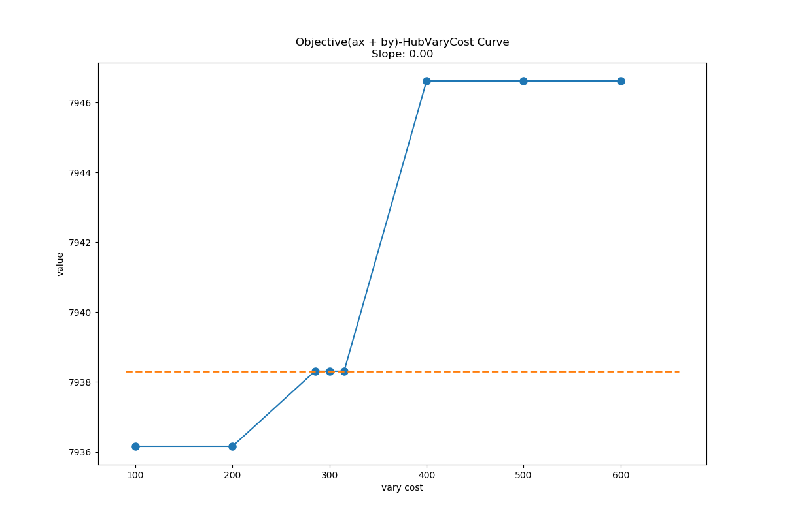
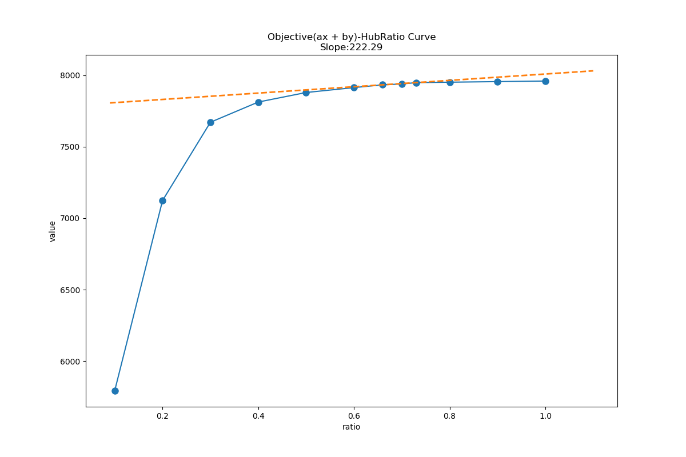

# Package-Delivery
> Project1 of Algroithms And Complexity(Spring 2019 SJTU)

## Introduction
&nbsp;&nbsp;In this project, we need to help the Express Company schedule the orders on "Double 11" Day.
Officially offered data are available [here(*.xlsx)](data).There are 4 different scenarios in total
(refer to the [problem.pdf](report/problem.pdf))for more details
* All of the 656 cities covered in the orders have stations
Design an efficient algorithm to transfer packages
* Hubs can transfer packages with lower unit cost, but a specific
hub can only use one transportation tool to transfer packages to each neighbour.
Design the scheme to build the hubs
* There may be some other constraints(e.g. Inflammable commodities
will be rejected by the hubs and can not be transported by
airlines). Besides, the hubs are capacitied. Revise the model
you designed above.
* If only large cities(cities with airline service) have station, 
how to schedule the packages efficiently?

## Demo
``` shell
git clone https://github.com/dbgns/package-delivery ~
echo "export PYTHONPATH=~/package-delivery/:$PYTHONPATH" >> ~/.bashrc
source ~/.bashrc

cd ~/package-delivery/src
python demo.py --problem_id 1 --num_orders 2400 --num_processes 16
```
## Default Parameters
|   Parameter    |     Value     |
|     :--:       |      :--:     |
| WeightOfAmount |      15       |
| WeightOfTime   |       1       |
|  HubCapacity   |      1000     |
| HubCostRatio   |       0.7     |
| HubConstCost   |      3000     |
|  HubVaryCOst   |       300     |
## Performance Evaluation
&nbsp;&nbsp;Using the paramters listed above, we run our model for 2400 orders and 240000 orders respectively.
#### Results of 2400 orders

|    id     |   AverageAmountCost($)  |   AverageTimeCost(min)    | 
| :--:      |         :--:            |        :--:               | 
| problem1  |          439.50         |         1357.80           | 
| problem2  |          437.94         |         1369.31(4 hubs)   |
| problem3  |          439.49         |         1359.79(32 hubs)  |
| problem4  |          969.08         |         3374.58           |

#### Results of 240000 orders

|    id     |   AverageAmountCost($)  |   AverageTimeCost(min)    | 
| :--:      |         :--:            |        :--:               | 
| problem1  |          443.59         |         1340.67           | 
| problem2  |          442.11         |         1359.00           |
| problem3  |          443.58         |         1342.18           |
| problem4  |          965.75         |         3322.68           |

> Note that intuitively in problem3 scenario we should build less hubs than problem2, but our model gives contrary results.
An explanation for this observation is our **assumption**: Hubs can co-exist with stations in problem3. Besides, we are uncertain about the setting of hub capacity(we speculate that it should be a medium value and ours is too small :-)

### Difference
&nbsp;&nbsp;We show the distributions of vehicles to offer an intutive feeling about the differences of strategies 





### Weight Tuning
&nbsp;&nbsp;We tune the weight of amount cost and the weight of time cost in our objective function. This curve reveals a good trade-off relationship between the two paramters.

&nbsp;&nbsp;Also we plot a 3D-figure

### Sensitivity Check
&nbsp;&nbsp;As a sensitivity check, we check the paramters relevant to the hubs





## Models And Detailed Results
&nbsp;&nbsp;We constructed our graph into \*.pkl model. Our strategies(\*.txt format) for each problem are also available. <br>
[models](http://resources.dbgns.com/package-delivery/models). [results](http://resources.dbgns.com/package-delivery/results).

**WARNING: This process may involve multiprocessing. Pay attention 
to your computational resources, as the process may be pretty slow and
computational intensive**

## Authors
JunjieWang, Yikai Yan, Wentao Qin
